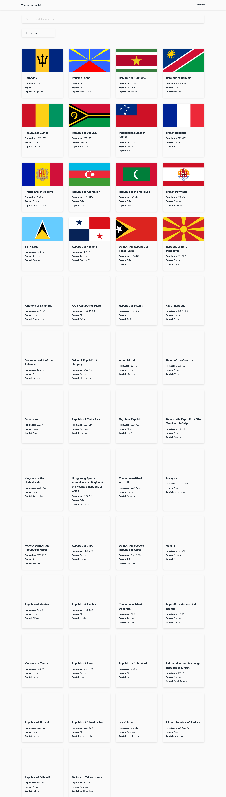

# Frontend Mentor - REST Countries API with color theme switcher solution

This is a solution to the [REST Countries API with color theme switcher challenge on Frontend Mentor](https://www.frontendmentor.io/challenges/rest-countries-api-with-color-theme-switcher-5cacc469fec04111f7b848ca). Frontend Mentor challenges help you improve your coding skills by building realistic projects. 

## Table of contents

- [Overview](#overview)
  - [The challenge](#the-challenge)
  - [Screenshot](#screenshot)
  - [Links](#links)
- [My process](#my-process)
  - [Built with](#built-with)
  - [What I learned](#what-i-learned)
  - [Continued development](#continued-development)
- [Author](#author)

**Note: Delete this note and update the table of contents based on what sections you keep.**

## Overview

### The challenge

Users should be able to:

- See all countries from the API on the homepage
- Search for a country using an `input` field
- Filter countries by region
- Click on a country to see more detailed information on a separate page
- Click through to the border countries on the detail page
- Toggle the color scheme between light and dark mode *(optional)*

### Screenshot

### Links

- Solution URL: [Add solution URL here](TBD)
- Live Site URL: [https://lj-search-countries.netlify.app/](https://lj-search-countries.netlify.app/)

### Built with

- Semantic HTML5 markup
- Mobile-first workflow
- Typescript
- [React](https://reactjs.org/) - JS library
- [Next.js](https://nextjs.org/) - React framework
- [TailwindCSS](https://tailwindcss.com/) - For styles

### Continued development
- Implement page transitions for smoother navigation when moving from the country list to an individual country view.
- Incorporate query parameters to allow users to filter countries by region more efficiently
- Improve loading UI

## Author

- Website - [Lloyd John Landeza](https://lloydjohncodes.netlify.com/)
- Frontend Mentor - [@lloydjohnlandeza](https://www.frontendmentor.io/profile/lloydjohnlandeza)
- Linkedin - [Lloyd John Landeza](https://www.linkedin.com/in/lloydjohnlandeza/)